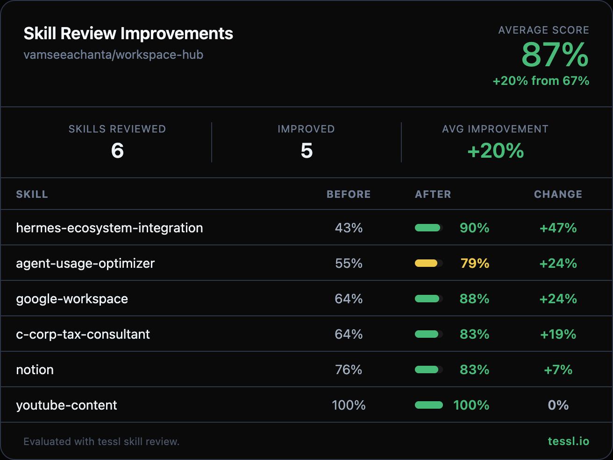

Hey @vamseeachanta 👋

I ran your skills through `tessl skill review` at work and found some targeted improvements. Here's the full before/after:

| Skill | Before | After | Change |
|-------|--------|-------|--------|
| hermes-ecosystem-integration | 43% | 90% | +47% |
| agent-usage-optimizer | 55% | 79% | +24% |
| google-workspace | 64% | 88% | +24% |
| c-corp-tax-consultant | 64% | 83% | +19% |
| notion | 76% | 83% | +7% |

Changes summary

**hermes-ecosystem-integration** (+47%)
- Rewrote frontmatter description with explicit "Use when..." clause and natural trigger terms (sync config, patches, health checks, multi-repo skill dirs, session export)
- Removed project-specific Per-Repo Agent/Command Ecosystem section (~60 lines of historical context and issue references)
- Removed Memory Health-Check Cron section (issue-specific implementation notes)
- Consolidated 11 pitfalls down to the 5 most critical ones
- Trimmed Write-Back Rules section — removed stale skill counts, issue numbers, and redundant symlink patterns while preserving all 4 core rules and the drift guard procedure

**agent-usage-optimizer** (+24%)
- Rewrote frontmatter description with explicit "Use when..." clause covering natural user terms (rate limits, quota usage, model selection, distribute tasks, API quota)

**google-workspace** (+24%)
- Rewrote frontmatter description with concrete per-service actions (send/read Gmail, create/list Calendar events, etc.) and explicit "Use when..." clause with natural trigger terms (send email, check calendar, schedule meetings, etc.)

**c-corp-tax-consultant** (+19%)
- Added explicit "Use when..." clause to description
- Fixed duplicate phase numbering (two Phase 5s → renumbered to Phase 6-9)
- Removed duplicate cost segregation example calculation
- Removed duplicate 1099-MISC reconciliation section (kept the more complete Phase 9 version)
- Removed entity-specific details (EIN, company name) from examples to improve generalizability
- Removed redundant NNN Property Acquisition gap explainer (already covered in reconciliation protocol)

**notion** (+7%)
- Added explicit "Use when..." clause to description with additional trigger terms (automate Notion workflows, query Notion data, command line)
- Added Error Handling section with common error codes and recovery actions (401, 404, 400, 429)
- Defined reusable `$NOTION_HEADERS` variable pattern to reduce header repetition

I kept this PR focused on the 5 skills with the biggest improvements to keep the diff reviewable. Happy to follow up with the rest in a separate PR if you'd like.

Honest disclosure — I work at @tesslio where we build tooling around skills like these. Not a pitch - just saw room for improvement and wanted to contribute.

Want to self-improve your skills? Just point your agent (Claude Code, Codex, etc.) at [this Tessl guide](https://docs.tessl.io/evaluate/optimize-a-skill-using-best-practices) and ask it to optimize your skill. Ping me - [@yogesh-tessl](https://github.com/yogesh-tessl) - if you hit any snags.

Thanks in advance 🙏
